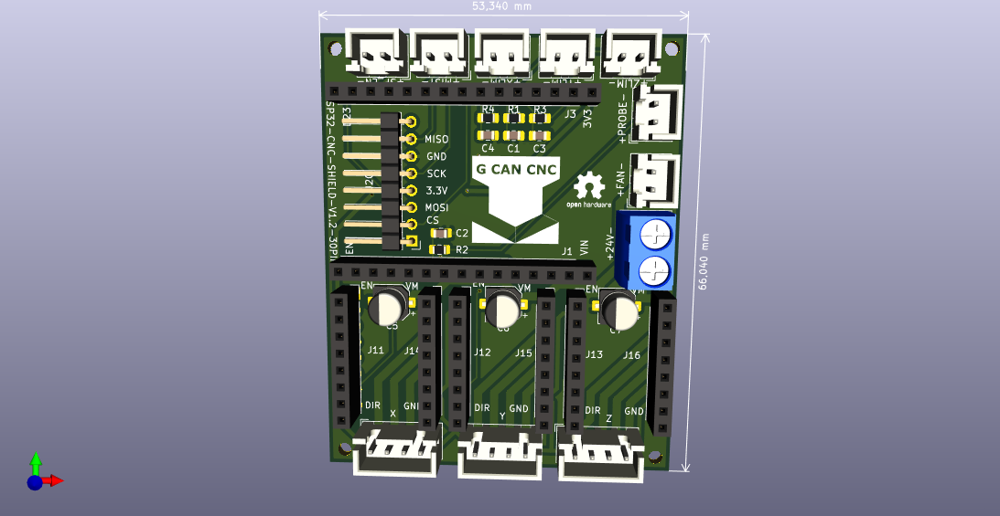
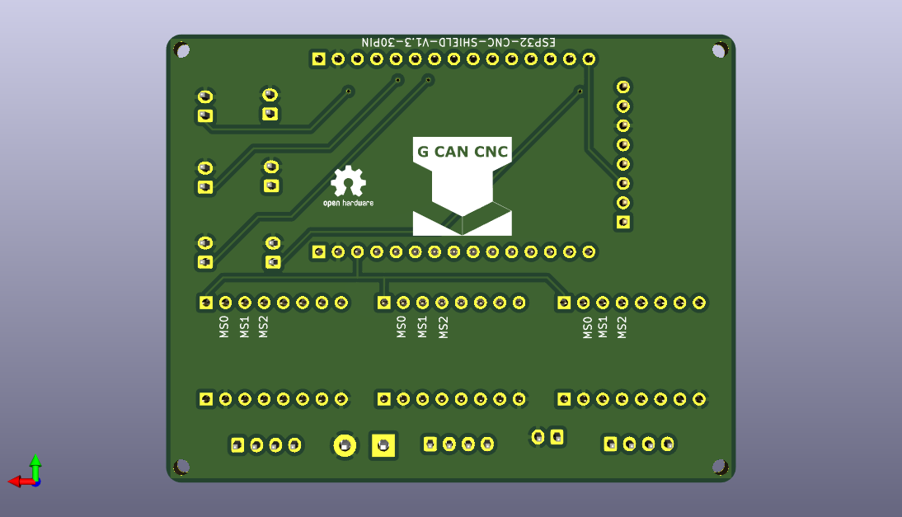

# ESP32_CNC_SHIELD_V1.2_30PIN_SMD
 Versión SMD 1.2 del ESP32 CNC SHIELD 30Pin
 
 
La placa mide ahora 53x66. Use conectores JST 2.5mm para evitar que los cables se suelten./n
Está pensado para usar con DRV8825 con 2 Micropasos, pero si se necesita más es solo empatar el MS0-MS1-MS1. 
Así tiene hasta 256 micropasos.

