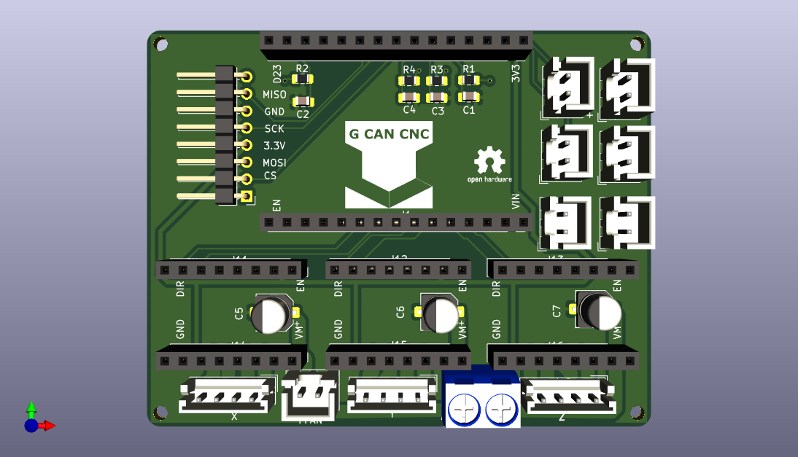

# ESP32_CNC_SHIELD_V1.2_30PIN_SMD
 SMD V1.2 ESP32 CNC SHIELD 30Pin
 
 
The board now measures 75x59(milimeters). Used JST 2.5mm to avoid loose cables.

It´s intended for run on DRV8825 driver with  2 microsteps, but if more is needed you can short MS0-MS1-MS2. 

So it get´s up to 256 microsteps.

